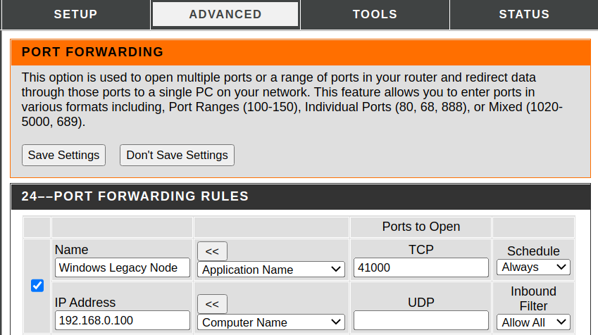

# BBPOW: A "no frills" proof-of-work Blockchain

---

## Installation

1. Install Python; versions 3.8, 3.9 or 3.10.
2. Install dependencies through pip
3. Port forward your public ip to your device through port 41000
4. Copy and download the github repo
4. Run "python gui" command

### Install python: Linux (Ubuntu)

We use python version 3.10 here as an example. But it will work for versions 3.8 and 3.9.

    sudo apt update && sudo apt upgrade -y
    sudo apt install software-properties-common -y
    sudo add-apt-repository ppa:deadsnakes/ppa
    sudo apt install python3.10

Verify the installation by checking the installed version.

    $ python3.10 --version
    3.10.4

### Install python: Windows

Download package and install. [Link to installation.](https://www.python.org/downloads/release/python-3107/)

### Install dependencies: Linux (Ubuntu)

First install pip if it's not already installed.

    apt install python3-pip

Finally install all dependencies using pip

    pip install pandas
    pip install requests
    pip install Flask
    pip install basicblockchains-ecc
    pip install primefac
    pip install waitress
    pip install PySimpleGUI

### Install dependencies: Windows

First insstall pip if it's not already installed. [Link to installation.](https://pip.pypa.io/en/stable/installation/)
Once pip installed, repeat all the "pip install" commands listed above.

### Port forward: Linux and Windows

Log into your router - this will normally require a wired connection from your computer to the router. In order to login
to the router, go to the router's address in a web browser, typically this is address: 192.168.0.1.

Once logged into the router, look for a section called "Port Forwarding". Select your device ip, and forward the port
41000 to that device through a tcp connection. Example:

### Clone the repo: Linux and Windows

In an appropriate directory, clone the repo by running:

    git clone https://github.com/BasicBlockchains/proof_of_work

(If git is not installed, you can install it here: [Install Git](https://www.atlassian.com/git/tutorials/install-git))

### Run the GUI

Finally, in the directory where you cloned the repo above, run

    python3.10 gui.py

This should launch the GUI. Select port 41000 and it should connect to the network and begin downloading the blocks
already saved to the chain.

### Run in Python

To save memory, you can run in a python shell using the following commands inside a python shell.

    >>> from bbpow.node import Node
    >>> from bbpow.api import run_app
    >>> import threading
    >>> n = Node()  #Optional port value ==> n = Node(port=xxxxx)
    >>> api_thread = threading.Thread(target=run_app, daemon=True, args=(n,))
    >>> api_thread.start()
    >>> n.connect_to_network()

Once you connect to the network, this should trigger the initial block download. From there, you can begin mining as
follows:

    >>> n.start_miner()

And similarly you can end mining as follows:

    >>> n.stop_miner()

---

 
---

    GUI
     |
     | - Api;
     | - Node
          |
          | - Wallet
          | - mine function
          | - Blockchain
                | 
                | - Database
                | - Block
                     |
                     | - MiningTransaction
                     |      |
                     |      | - UTXO_OUTPUT
                     |
                     | - Transaction
                            |
                            | - UTXO_OUTPUT
                            | - UTXO_INPUT

---

## Encryption

The BB-POW uses elliptic curve cryptography (ECC), employing the custom package we have
written. [Pypi package](https://pypi.org/project/basicblockchains-ecc/)

We use the standard secp256k1 elliptic curve for cryptographic purposes. This curve will be used to generate the public
key from a private key, as well as for digital signatures. All signatures will follow the elliptic curve digital
signature algorithm (ECDSA), wherein the private key can create a signature and the public key can be used to validate
the signature. Note that the private key will be an integer of roughly 256 bit length, and the public key will be a pair
of integers of similar bit length. This public key represents a point on the elliptic curve and so we refer to these
integers as the x- and y-coordinates. We follow convention by compressing the public key according to the parity of the
y-coordinate; where we use *0x02* to indicate even and *0x03* to indicate odd, and refer to this as the compressed
public key (cpk). Both the private key and public key will be expressed as integers, but the compressed public key will
be expressed as a hexadecimal (hex) string **with** the leading '0x'.

In addition to the elliptic curve encryption, we use the SHA256 hash function to generate ids for all the objects in the
blockchain. Additionally, SHA256 along with SHA1 will be used in order to create a user address.

## Wallet

The Wallet class contains the private and public keys used in the ECC. Each wallet can be represented by a seed value,
which will be a randomly generated 256-bit integer. This will be saved as a hex string in plaintext to the user's
harddrive.

The Wallet class contains the private and public keys used in the blockchain. We use the private key in the ECDSA; given
a transaction id string, a unique signature can be generated by the wallet using the private key. Note that the ECDSA
contains randomness, so two signatures for the same transaction (tx) id may be completely different, but both still
valid. From the ECDSA, we see that we can use the public key in order to verify a signature, without having to reveal
the private key. Thus, in this fashion, we fix our signature for a given tx id to be the compressed public key along
with the pair of integers generated by the ECDSA from the private key.

### Address and BASE58 Encoding

The create_address algorithm is as follows:

    -Take the SHA1 of the SHA256 of the compressed public key (with leading 0x in the hex string). This yields the encoded public key (EPK)
    -We ensure that the EPK is 40 characters - WILL NOT CONTAIN A LEADING "0x"
    -We take the first 8 characters of the SHA256 of the SHA256 of the EPK. This is the checksum
    -We append the checksum to the EPK to create the checksum encoded public key (CEPK). THIS IS A HEX STRING OF 48 CHARACTERS WITHOUT THE LEADING "0x"
    -Finally we append the 2 character code for the address type. This yields a hex string of 50 characters.
    -The address is the BASE58 encoding of the 50-character hex string: type + EPK + checksum

## Transactions and UTXOs

We follow Bitcoin in adopting the UTXO model for recording financial transactions.

The blockchain produces new currency through mining (see below). In short, every new block which is saved to the
blockchain will contain a unique MiningTransaction. This MiningTransaction is how new coins are added to the Blockchain.

Each MiningTransaction will contain an unspent transaction output (UTXO), for which the class is called UTXO_OUTPUT.
Each output will contain an integer value, a wallet address, as well as an optional block_height value. This output
indicates that the user with that address is the current owner of the amount of coins in the utxo; the block_height
means that the utxo can't be used in any transaction until the chain has reached that height.

Additionally, each MiningTransaction will contain some periphery information about the state of the chain when the block
was mined.

For peer-to-peer (P2P) transactions, we have the Transaction class, which accepts a list of UTXO_OUTPUTs as well as a
list of UTXO_INPUTs as well. The UTXO_INPUT class will contain a tx id and an index value, which uniquely identify a
UTXO_OUTPUT; and the input will contain a signature for the UTXO_OUTPUT. The signature contains the compressed public
key, which will be used to identity the address of the UTXO_OUTPUT. As well, the signature contains the ECDSA signature
tuple, which, along with the compressed public key and tx_id, is used to validate the signature.

When a Transaction gets saved to the blockchain, the UTXO_OUTPUTS referred to by the UTXO_INPUT will get removed from
the Node database; we refer to this as "consuming" the utxos.

## Block

A Block is the class which is saved to the Blockchain. It will contain some header information, packaged in the Header
class, as well as a MiningTransaction and a list of Transactions. Each Block must contain a MiningTransaction, but any
user Transactions are optional. However, the MiningTransaction will contain $0 block fees, whereas the Transaction must
contain a non-zero block fee. Hence, the Miner is incentivized to include as many Transactions as possible in order to
collect the maximum amount of fees.

The Header contains the following fields:

    -Previous id
    -Merkle root
    -Target
    -Nonce
    -Timestamp

### Merkle root

A Merkle root (AKA: Merkle tree) is a method for uniquely identifying a list of Transactions, as well as a quicker way
to prove these Transactions have been saved in the Block. Every Transaction and MiningTransaction will contain a unique
id; this will be the SHA256 hex digest of the raw transaction. We can create a Merkle tree from these tx ids following
standard Merkle tree construction, as described [here](https://en.wikipedia.org/wiki/Merkle_tree).

## Blockchain

The Blockchain is the ordered sequence of mined blocks. Each Blockchain is first instantiated with some initial values
for the mine amount, mining reward and target. Subsequently, blocks are either loaded from the database or downloaded
from the node network (if the Blockchain is run inside a Node.) One of the most fundamental identities of the Blockchain
is the HEARTBEAT, which we fix to be 60s (1 minute). We use the heartbeat as a standard metric whenever the state of the
chain must be updated and/or verified.

### Forks

When the Blockchain is being run inside a Node, there is a possibility that two Blocks mined by different Miners may
arrive at Nodes at different times. If a Block has height equal to the current height of the Blockchain, or a height
less than the current height but within HEARTBEAT blocks, then a fork will be created in the Blockchain to track these
differences. When the next Block arrives, it may have the forked Block's previous id rather than the saved Block's
previous id. In this case, the Blockchain will check the forks if validation of the arriving Block fails.

We mention as well that verifying the forks will work recursively, in the case that competing chains exist in the Node
network. Ultimately any competing chains should be resolved once greater than 50% of the Nodes have chosen a Block.

### Target

For a Block to be mined successfully, the id of the Block (which is just an integer) must be less than or equal to the
target. The target is saved within a Block as an 8-character coefficient/exponent pair, where 6 characters are used for
the coefficient and 2 characters are used for the exponent. The target is then computed by the formula

    coeff * pow(2, 8 * (exp - 3))

As each Block id will have a maximum bit length of 256 bits, the maximum value of the coefficient is

    pow(16,6) - 1

and as we don't want the target to exceed pow(2,256), the maximum value of the exponent is 31.

In the GUI, the target will be displayed in the Miner tab, with the option to display the target as the 8-character hex
encoding, or as a hex string for easy comparison with the Block id.

### Database

We use SQLite3 as our database. This has a type limitation as their integers are signed and only store (-2^63+1,
2^63-1). Thus all integers saved to the db will be given as hex strings with a prepended '0x'.

I would like to thank Jurko Gospodnetic of stackoverflow for his db query design.
-https://stackoverflow.com/questions/9561832/what-if-i-dont-close-the-database-connection-in-python-sqlite

The Database has 2 tables:

    -raw_blocks
    -utxo_pool

The raw_block table contains the raw form of each Block, where the height of the Block corresponds to the row
number plus one (accounting for genesis Block).

The utxo_pool contains all those UTXO_OUTPUTs which have not yet been consumed.

## Validation

In order for a Transaction to be valid, it must meet the following requirements:

    -Every utxo output referenced in the inputs of the tx must exist in the database
    -Every signature in a utxo_input has a cpk that resolves to the address in the referenced utxo_output
    -The total input amount (total amount referenced by inputs) strictly exceeds total amount of the outputs

In order for a MiningTransaction to be valid, it must meet the following requirements:

    -The height of the mining tx must be equal to height of previous block + 1
    -The block height in the mining_utxo in the mining tx must be equal to the height of the previous block + 1 + the mining delay amount
    -The amount in the mining_utxo of the mining tx must be equal to the mining_tx reward + the mining_tx block_fees

In order for a Block to be valid, it must meet the following requirements:

    -The block.id integer is less than the block target
    -The block target agrees with the blockchain target at that height
    -The block previous_id must agree to the id of the previous block
    -The height of the mining tx must equal the height of the previous block + 1

## Mining